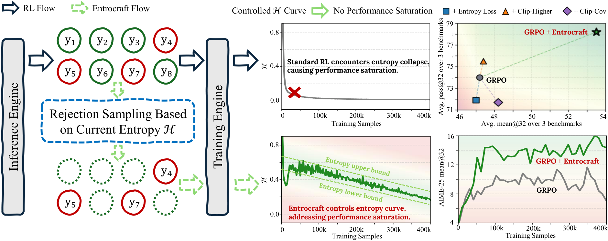

# Entrocraft

This repository contains RL training scripts built on top of `verl`, with
examples for Entrocraft training.

[](overview.pdf)

## Environment Setup

Create and activate the environment expected by the training scripts.

```bash
conda create -n verl python=3.10 -y
conda activate verl
bash install_verl.sh
```

The installation script clones `verl`, installs the vLLM/SGLang stack, installs
`verl` in editable mode, and installs the additional Python packages used by
the math data and reward pipeline.

On a Slurm cluster, the training scripts assume CUDA and Conda modules are
available:

```bash
module load cuda/12.6.0
module load conda/2024.09
conda activate verl
```

Before submitting a Slurm job, replace the release placeholders in the script:

```bash
#SBATCH --account=<SLURM_ACCOUNT>
#SBATCH --mail-user=<USER_EMAIL>
project_name="project_name"
```

Use a cluster allocation for `<SLURM_ACCOUNT>`, an email address for
`<USER_EMAIL>`, and a tracking project name for `project_name`.

## Data Preparation

Generate the Numina Math training parquet with:

```bash
python scripts/data_preprocess/numina_math_100k.py \
  --local_dir ./data/numina_math_100k \
  --model_name_or_path Qwen/Qwen3-4B-Thinking-2507
```

This script downloads `ScaleML-RLHF/numina_math` from Hugging Face, filters
long prompts with the tokenizer, formats each example as a chat prompt, and
writes:

```text
data/numina_math_100k/train.parquet
```

The Entrocraft example also expects these evaluation files:

```text
data/math500/test.parquet
data/amc23/test.parquet
data/aime24/test.parquet
data/aime25/test.parquet
data/aime26/test.parquet
```

## Running GRPO + EntroCraft

Use the range-linear GRPO script as the reference Entrocraft run:

```bash
scripts/grpo/grpo_range_linear/qwen3-4b-base_numina_math_grpo_range_linear_n8.slurm
```

It trains `Qwen/Qwen3-4B-Base` on Numina Math with 8 rollouts per prompt and
uses the `grpo_range_linear` advantage estimator:

```bash
algorithm.adv_estimator=grpo_range_linear
algorithm.entropy_control.entropy_lower_bound_range='[0.6, 0.4]'
algorithm.entropy_control.entropy_upper_bound_range='[0.7, 0.5]'
```

Submit the job with:

```bash
sbatch scripts/grpo/grpo_range_linear/qwen3-4b-base_numina_math_grpo_range_linear_n8.slurm
```

When submitted through Slurm, the script logs to console and Weights & Biases.
When run directly or in a debug job, it uses console logging only.

The main outputs are written under:

```text
checkpoints/<project_name>/qwen3-4b-base_numina_math_grpo_range_linear_n8
logs/slurm-<job_id>.out
logs/slurm-<job_id>.err
```

## Citation

If you find Entrocraft useful, please cite:

```bibtex
@article{li2026addressing,
  title={Addressing Performance Saturation for LLM RL via Precise Entropy Curve Control},
  author={Li, Bolian and Wang, Yifan and Ding, Yi and Lochab, Anamika and Grama, Ananth and Zhang, Ruqi},
  journal={arXiv preprint arXiv:2604.26326},
  year={2026}
}
```
